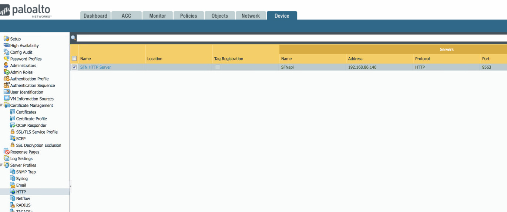
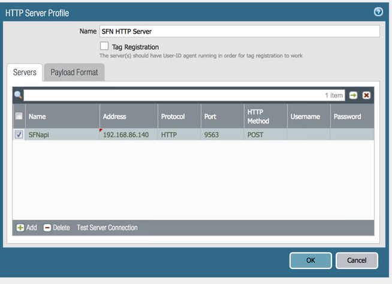
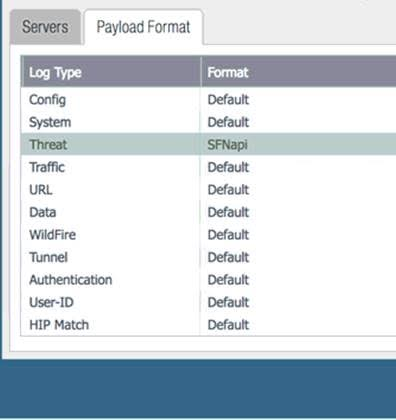
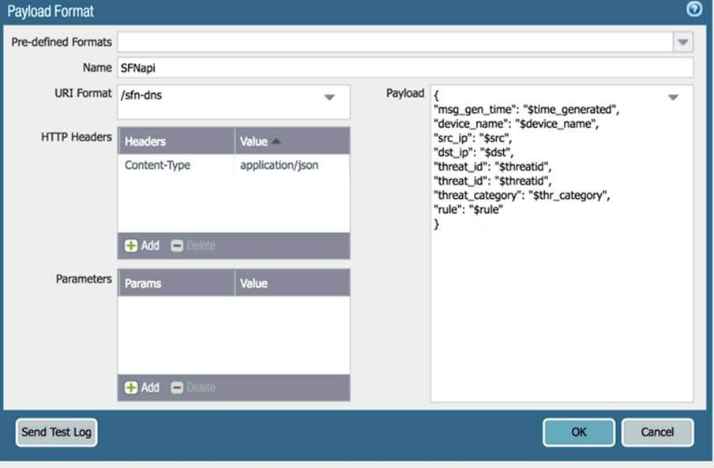

If you have a FW configured to send to SFN 1.x, skip to step [Device HTTP Profile](#device-http=profile).

< INSERT NEW FW CONFIG STEPS HERE>


### Device HTTP Profile
To configure the FW to send to the new system, you will need to do the following:
1. Under the Device tab, Server Profiles -> HTTP either edit the old profile for the 1.x server or create a new one.   Click on the Name

<br/><br/><br/><br/>


2. Make sure your server profile looks like this (the Name at the top will be whatever you called it, but the rest should be the same) and then click on the Payload Format tab

<br/><br/><br/><br/>

3. Click on Threat<br/>

<br/><br/><br/><br/>

Name can be whatever you want

URI Format is /sfn-dns

Headers will be application/json

In the payload, cut and paste the json below the picture (it should work – if it doesn’t, you will have to put it in by hand).

Click Send Test Log – it should work. 

 
<br/><br/><br/><br/>

```json
{
 "msg_gen_time": "$time_generated",
 "device_name": "$device_name",
 "src_ip": "$src",
 "dst_ip": "$dst",
 "threat_id": "$threatid",
 "threat_category": "$thr_category",
 "rule": "$rule"
}
```