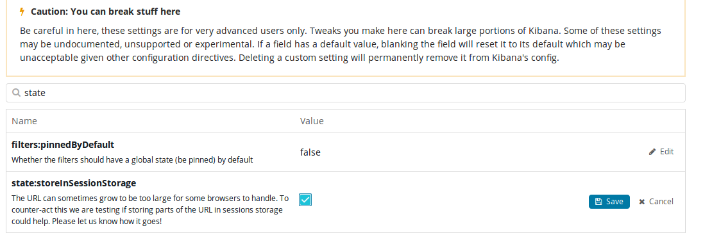
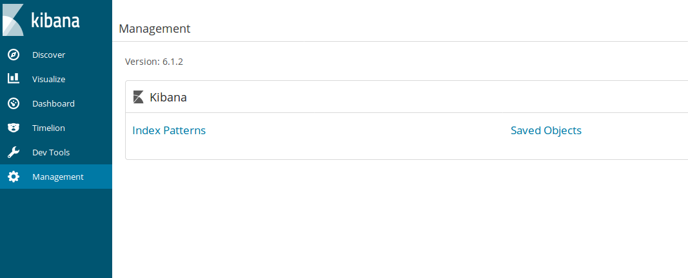
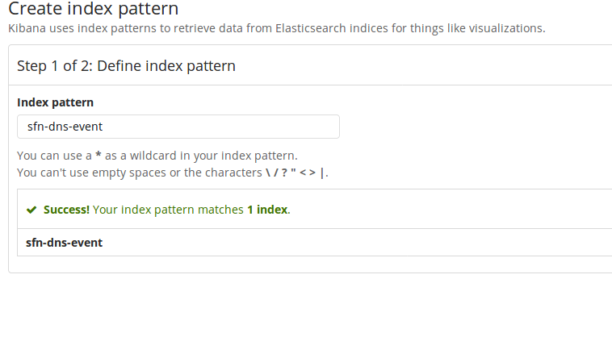
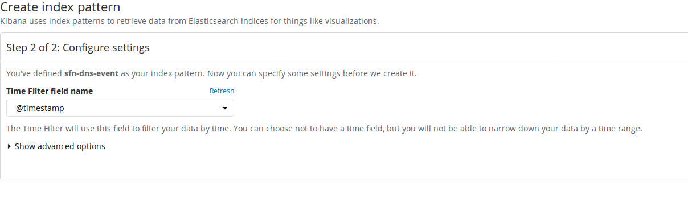
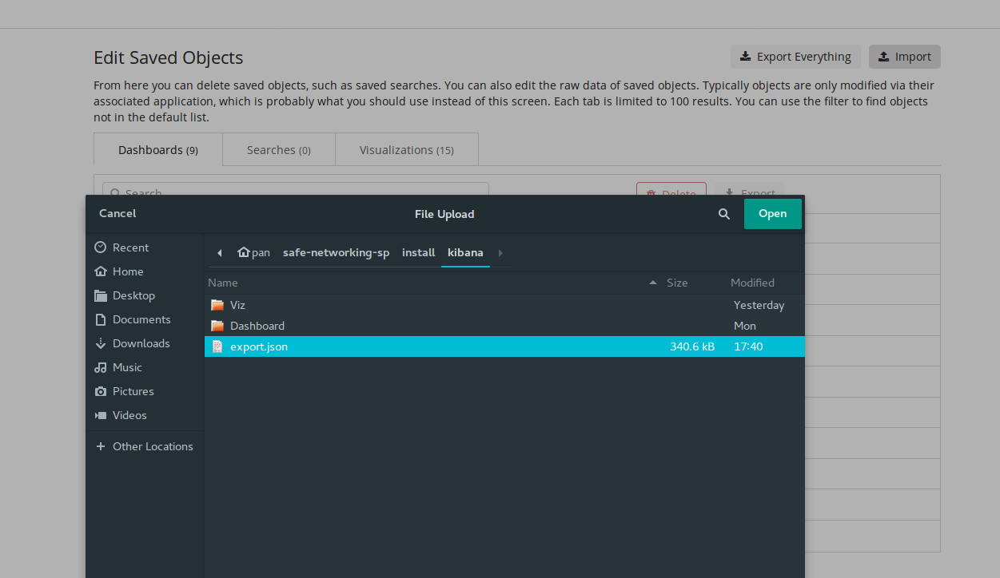
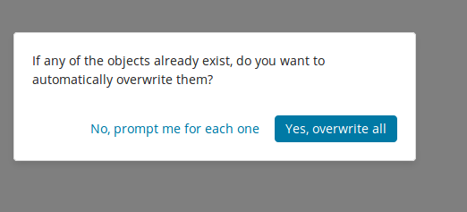
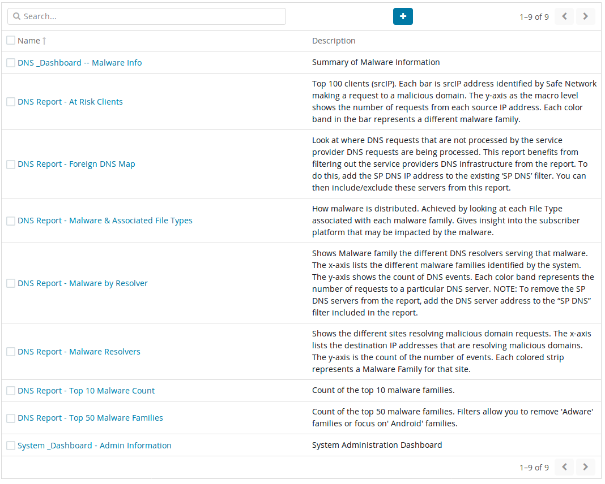

# Configure for large URLs
The URL can sometimes grow to be too large for some browsers to handle. To counter-act this change the **state:storeInSessionStorage** setting to true in the Management -> Advance Settings section.  See screenshot.

    

# Set up index patterns 
### NOTE: This will not work if there is not data to index.  Make sure your firewall is sending data first.
Click on the Management tab on the left hand side and click "Index Patterns"

    
The first index to set up is the sfn-dns-event index.  Put that name in the text box and it should match the index as in the screenshot.  Click the next step button.
  
 
For the "Time filter field name" select the @timestamp in the dropdown and click the create index pattern button

    
#### Follow the same procedure for the af-details index, but in the "Time filter field name" dropdown select "I don't want to use the Time Filter" 
#### We don't need index patterns for sfn-domain-details or sfn-tag-details
    

# Import Reports & Dashboards
Import the pre-defined Reports and Dashboards from the install/kibana/export.json file included in the repository
    
Click on the Management tab on the left hand side and click "Saved Objects"

    
On the Saved Objects page, click on the Import icon in the top right and navigate to select the export.json file from install/kibana:

    
When importing, it will ask if it should overwrite or prompt.  Select overwrite:

    
As the visualizations get imported, you will need to select the index that they are associated with.  You should make the imports the same as the following screenshot.

    
Click on the Dashboard tab on the left hand side of the screen, If everything goes as planned, you should now have multiple dashboards and reports to start viewing the data.
